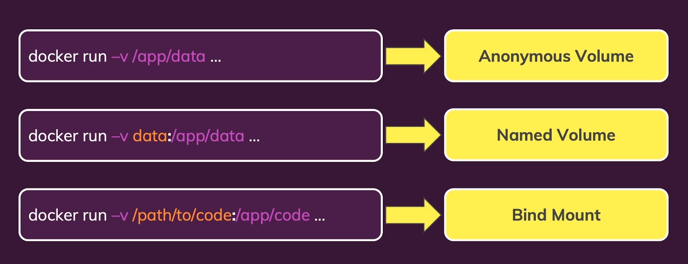
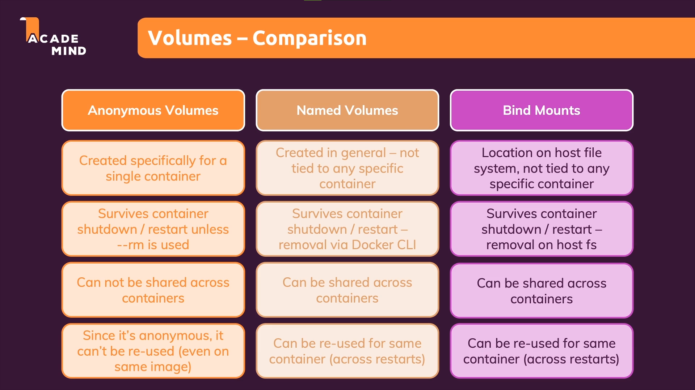
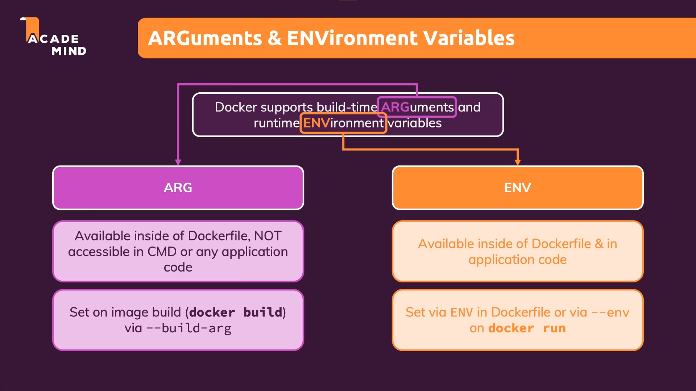
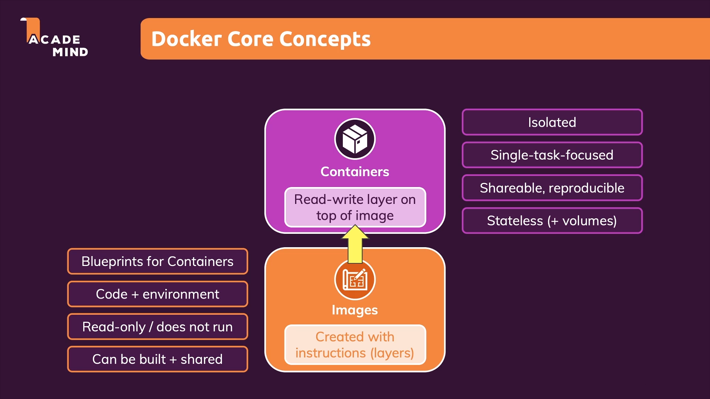

- Docker is a container technology: A tool for creating and managing containers.
- A container is a standardized unit of software (A package of code and dependencies to run that code Eg: Nodejs code + the Nodejs Runtime)
- The same container yields the exact same application and execution behavior! No matter where or by whom it might be executed.

 - Unlike the VMs which is spinned up on the machines, docker communicates with  OS built support (Emulated Container Support) and on top of that it has docker engine which has the capacity of spin up multiple containers. These containers contain our code, runtime, tools, dependencies along with a small OS layer but they doesn't contain the whole bloated OS which has  unnecessary tools.


 ## Images and Containers
- One image and multiple containers
- Image  are templates or blueprints for containers. It contains the code, required tools and runtime
-  Containers are actual running instances of images. They are created from the image and are not bound to the host machine. They can be run on any machine.
-  Multiple containers can be created from the same image.
  
### Layers
- Each instruction in the docker file represents a layer
- An image is made up of multiple layers based on these instructions
- These layers are cached.
- These layers are read only once build.
- Once the container is started one more container base layer is added on top of these layers. This container layer is read-write and can be modified.
- After any modifications to the code layer corresponding to the changed instruction  and the subsequent layers are rebuilt. Other layers on top of it fetched from the cache.

### Volumes
- Volumes helps to persist the data even if the container is removed
- Volumes are the folders in the host machine hard drive which are mounted (made available or mapped) to the container.
- A container can read and write data into a volume and read data from it
- There are two types of volumes - anonymous and named. Anonymous volume only exists as long as the container exists. If the container is removed it is gone. It is managed by docker engine.
- In case of named volumes volumes, folder in the host drive  will survive the container shutdown
- We don't know where the volumes lies in the host machine

### Bind Mounts
- Persistent and editable data.
- we define the path in the host machine
- This is also a volume where instead of volume name we define the path which should be watched for file changes.
- The path should be absolute
- But one problem is we overwrite the container files with bind mount file contents which does not have node modules
- So after adding the bind mount volume we can add anonymous volume that includes the node_modules
```bash
docker run  --name feedback-bind-mount -d -p 8080:3000 -v feedback:/app/feedback -v "C:\Users\niranjan.santhosh\DATA\personal\practise\docker-course\app-volumes:/app" -v /app/node_modules bdb7347e347f
```



```bash
docker run -d -p 8080:3000 -v feedback:/app/feedback -v "C:\Users\niranjan.santhosh\DATA\personal\practise\docker-course\app-volumes:/app:ro" -v /app/node_modules -v /app/temp  bdb7347e347f
 ```
- In the above command we make the bind mount read only by adding "ro" but then we need to specify "/app/temp" because here writing happens



```bash
docker run -d --rm -p:8080:5000 --env PORT=5000 b604a493984493e2f846a6c6ac5bf13dc5173ba5d783c793fce1182e989ca309 
```
- the --env flag will help to allow set env variables that are available in the runtime also (--env or -e)
- to include the .env file add the flag --env-file

```bash
    docker build -t feedback:arg --build-arg DEFAULT_PORT=4000 . 
# here the DEFAULT_PORT argument variable is used in the Dockerfile so that when we build the docker image we will be using this value in the runtime
 ```

### Containers and Networks
- requests from container to www
- requests from container to service running in the host machine
- requests from container to other container

- use **host.docker.internal** to connect to services running in host

### Networks
- Using networks in docker we can create set of networks and connect all the container required to this network
- First we need to create a network, then run different containers using --network flag
- So in this case we can use the containers names instead of the IP and docker will automatically resolve it for us


## Compose
- Docker compose is used to manage multi container applications
- We don't need to specify the -d or --rm flag in the compose file because default behavior is detached only.
- Also it creates default network
- the container will be started on docker-compose up command and it will removed on down command
- network also will be deleted but we need to clear volume manually

### Util Containers
docker build -t node-util .
docker run -it -v C:\Users\niranjan.santhosh\DATA\personal\practise\docker-course\util-container:/ap node-util yarn init
docker-compose run yarn-util 


### Multi Stage Builds
- If creating the image involves multiple stages we can make use of this concept.
- Define the first base image using "as"
- In the next stage refer to the base stage using "--from="
- In the build step we can refer to stage using the "-target directive"



###
- Never use container names to point to network in cloud deployments